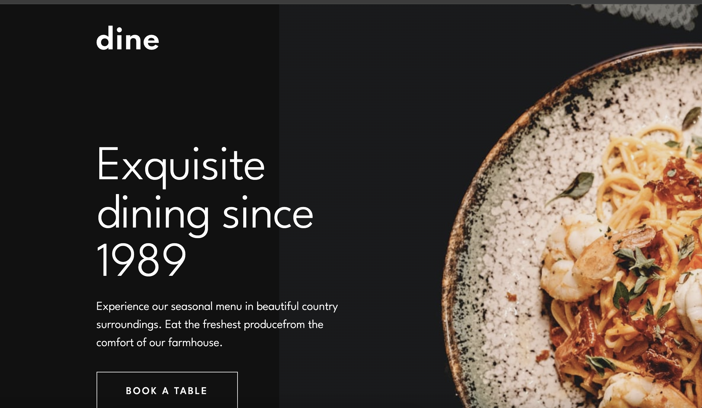
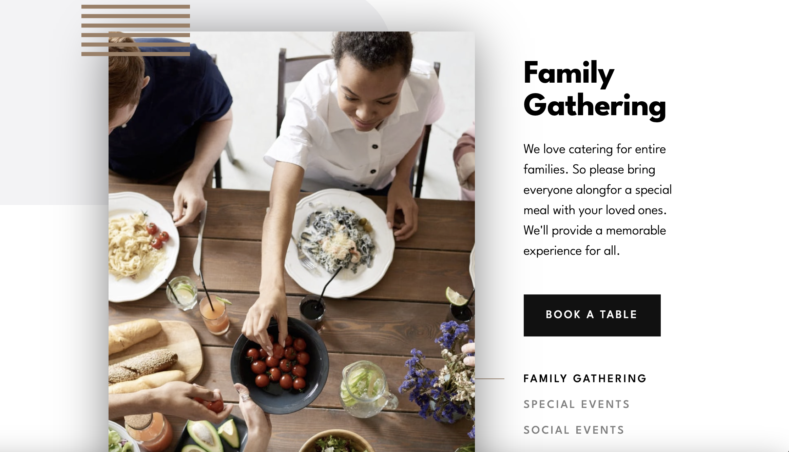
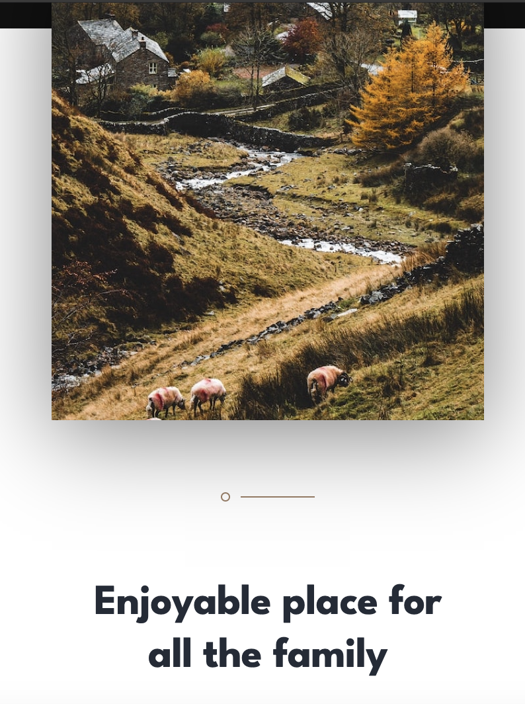
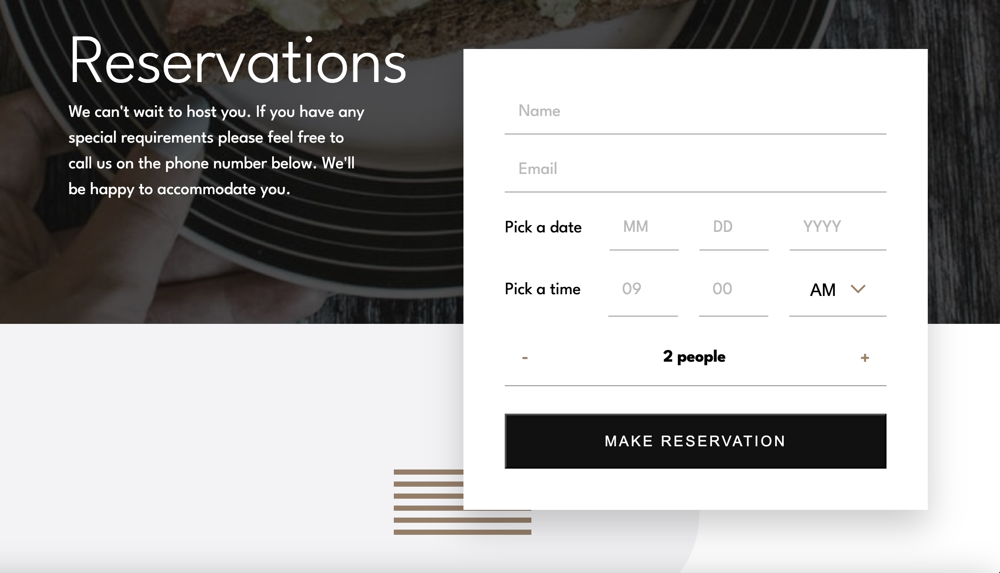
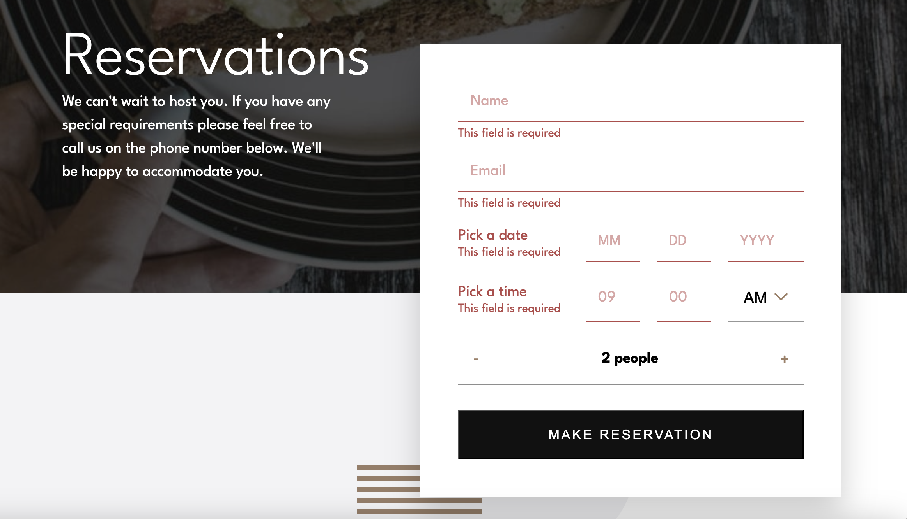
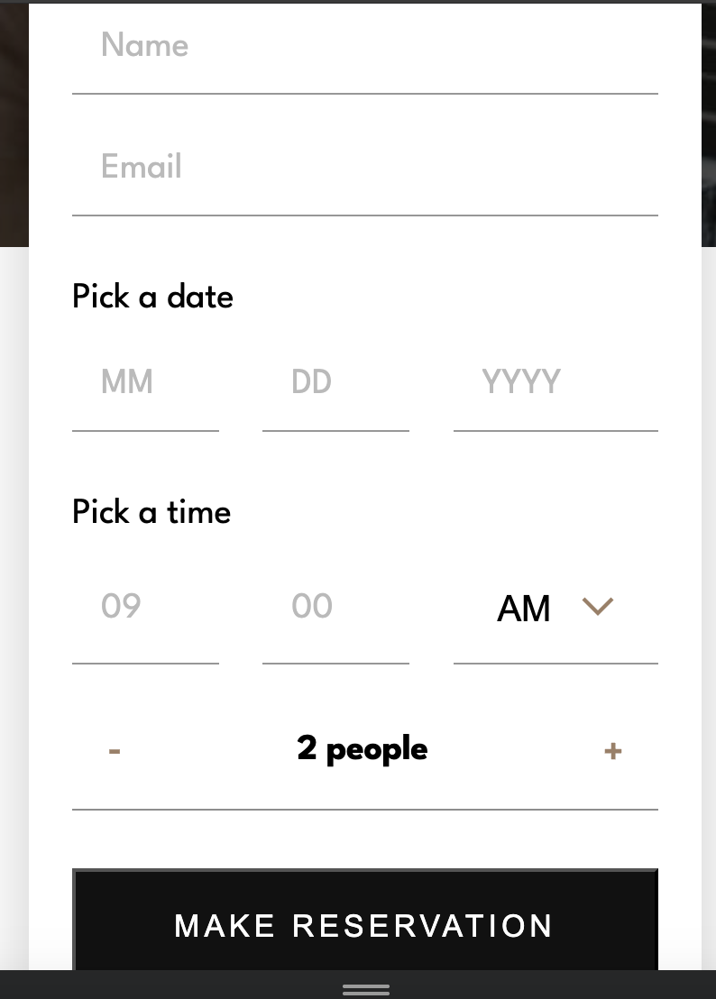

# Frontend Mentor - Dine Website Challenge solution

This is a solution to the [Dine Website Challenge challenge on Frontend Mentor](https://www.frontendmentor.io/challenges/dine-restaurant-website-yAt7Vvxt7). Frontend Mentor challenges help you improve your coding skills by building realistic projects.

## Table of contents

- [Overview](#overview)
  - [The challenge](#the-challenge)
  - [Screenshot](#screenshot)
  - [Links](#links)
- [My process](#my-process)
  - [Built with](#built-with)
  - [What I learned](#what-i-learned)
  - [Continued development](#continued-development)
- [Author](#author)

**Note: Delete this note and update the table of contents based on what sections you keep.**

## Overview

### The challenge

Users should be able to:

- View the optimal layout for each page depending on their device's screen size
- See hover states for all interactive elements throughout the site
- See the correct content for the Family Gatherings, Special Events, and Social Events section when the user clicks each tab
- Receive an error message when the booking form is submitted if:
  - The `Name` or `Email Address` fields are empty should show "This field is required"
  - The `Email Address` is not formatted correctly should show "Please use a valid email address"
  - Any of the `Pick a date` or `Pick a time` fields are empty should show "This field is incomplete"

### Screenshot

### Links

- Solution URL: [Add solution URL here](https://stanishcode.github.io/dine-restaurant/index.html)
- Live Site URL: [Add live site URL here](https://stanishcode.github.io/dine-restaurant/index.html)

## My process

### Built with

- Semantic HTML5 markup
- CSS custom properties
- Flexbox
- Vite
- Javascript
- Desktop-first workflow

### What I learned

During this project, I have learned a handful of new conecpts and techniques. Using picture elemets along with source elements using srcset attribute was a useful technique to only render images that work best for the user's device which is great for website performance.

### Continued development

Still learning how to make responisve layouts and components, especially images. After doing media queries, I have noticed I had to write too many every 100px or so. So this project help me realize I need to write more effective and effiecient ways to make more responsive layouts and components.

## Author

- Frontend Mentor - [@StanishCode](https://www.frontendmentor.io/profile/StanishCode)
